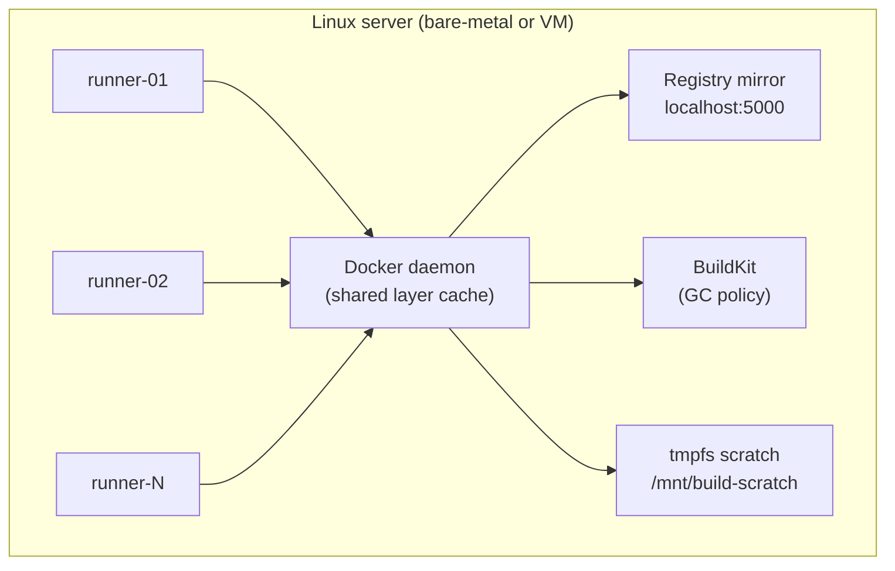

# Ansible — Self-Hosted GitHub Actions Runner

Provisions a Linux machine as a production-grade, self-hosted GitHub Actions runner. Runs multiple concurrent runner instances sharing a single Docker daemon with a pull-through registry mirror.

## Why self-host your runners?

GitHub-hosted runners are convenient — until they're not. At scale, you hit three walls:

1. **Cost.** GitHub charges per-minute for Actions. Standard 2-core Linux runners are cheap (~$36/month overage for 20 builds/day at 15 min each on the Team plan), but most real CI workloads need larger runners — an 8-core runner costs ~$0.064/min, and a 16-core hits ~$0.128/min. At 9,000 minutes/month that's $576–$1,152. A single bare-metal server ($50–150/month) handles the same load with room to spare.

   > **Self-Hosted "Tax":** GitHub introduced a $0.002/minute platform fee for self-hosted runners in private repositories (effective March 2026). Even with this fee, a dedicated server remains 5x–10x cheaper than buying managed minutes.

2. **Speed.** GitHub-hosted runners are ephemeral VMs. While you can use registry cache or GitHub Actions cache to persist Docker layers, every build still pulls them over the network — there's no local layer cache, no local registry mirror. Self-hosted runners keep a warm local cache, so subsequent builds pull nothing and finish in a fraction of the time.

3. **Control.** Need GPUs? Specific kernel modules? More than 14 GB of RAM? A particular CPU architecture? Self-hosted runners give you the machine you actually need, not a lowest-common-denominator VM.

This playbook handles the hard part: turning a fresh Linux box into hardened, multi-instance CI infrastructure with proper caching, security, and automated maintenance.

## What you get

- **Configurable concurrency** — run 1, 4, 8, or more runner instances in parallel (default: 8). Each picks up one job at a time, all sharing a single Docker daemon
- **Pull-through registry mirror** — caches Docker Hub pulls locally, eliminates rate limits and speeds up image fetches
- **BuildKit with persistent cache** — warm builds across jobs and reboots, GC'd at a configurable threshold
- **tmpfs scratch volume** — RAM-backed ephemeral storage for fast intermediate I/O during builds
- **OS hardening** — SSH key-only auth, UFW firewall, fail2ban, unattended security upgrades, sysctl tuning
- **Automated maintenance** — included GitHub Actions workflow to re-run the playbook weekly (disabled by default, enable when ready)
- **Idempotent** — safe to run repeatedly. Only changes what's drifted.

## Quick start

### 0. Get the playbook

**Fork this repo** (recommended) — lets you commit your inventory and configuration changes to your own copy:

1. Click **Fork** on GitHub
2. Clone your fork: `git clone git@github.com:<your-org>/ansible-github-runner.git`
3. Enable the maintenance workflow in your fork's Actions tab when ready

Or just clone directly to try it out:

```bash
git clone https://github.com/gantryops/ansible-github-runner.git
cd ansible-github-runner
```

### 1. Provision a server

Any Linux box works — bare-metal, VPS, cloud VM. Install **Ubuntu 24.04 LTS** (minimal/server) and ensure SSH access as `root` with your key.

**Recommended specs** (adjust to your workload):

| Workload | CPU | RAM | Disk |
|----------|-----|-----|------|
| Light (lint, test, small builds) | 4+ cores | 16 GB | 100 GB SSD |
| Medium (Docker builds, integration tests) | 8+ cores | 32 GB | 200 GB SSD |
| Heavy (parallel builds, large monorepos) | 16+ cores | 64+ GB | 500 GB SSD/NVMe |

**Our recommendation:** [Hetzner server auction](https://www.hetzner.com/sb/) offers the best performance per dollar for CI workloads. Look for an AX102 or similar — 32-core AMD EPYC, 128 GB ECC RAM, 2× NVMe. You'll get 10–20x the compute of a GitHub-hosted runner for a fraction of the cost. For cloud VM benchmarks and price comparisons, see [Cloud VM Benchmarks 2026](https://devblog.ecuadors.net/cloud-vm-benchmarks-2026-performance-price-1i1m.html).

> **Tip: hourly-billed VMs.** If you're using a cloud provider that bills by the hour, you don't need to run your runner 24/7. Use a [GitHub Actions schedule](https://docs.github.com/en/actions/using-workflows/events-that-trigger-workflows#schedule) to start the VM before business hours and stop it at night/weekends, or use an auto-scaler to spin instances up on demand. This way you only pay for the hours you actually use.

### 2. Configure

Copy the example inventory and fill in your server's IP:

```bash
cp inventory/hosts.yml.example inventory/hosts.yml
```

```yaml
# inventory/hosts.yml
runner-01:
  ansible_host: <IP_ADDRESS>
  ansible_user: root
```

Edit `group_vars/runners.yml`. At minimum, set your GitHub org:

```yaml
github_org: your-org
```

#### Runner scope

By default, runners register at the **organisation** level (available to all repos). To scope them to a single repository:

```yaml
github_runner_scope: repo
github_repo: my-app
```

#### Automatic registration (recommended)

Set a GitHub Personal Access Token and the playbook handles registration for you — no manual SSH required:

```yaml
github_pat: ghp_xxxxxxxxxxxxxxxxxxxx
```

Required PAT scopes: `admin:org` for org runners, `repo` for repo-scoped runners.

The playbook calls the GitHub API to get a short-lived registration token, then runs `config.sh --unattended` for each instance. Runners are registered and started automatically.

#### Manual registration

If you prefer not to provide a PAT, leave `github_pat` empty. After the playbook finishes, SSH in and register manually (adjust the loop to match your `runner_count`):

```bash
ssh root@<IP_ADDRESS>

TOKEN="<paste registration token from GitHub UI>"
for i in 01 02 03 04 05 06 07 08; do
  sudo -u runner bash -c "cd /opt/actions-runner/$i && ./config.sh --unattended --url https://github.com/<your-org> --token $TOKEN --name runner-$i --work _work --labels self-hosted,linux,x64"
done

# Then start the services:
for i in 01 02 03 04 05 06 07 08; do
  systemctl start github-runner-$i
done
```

#### Registry mirror

A pull-through Docker Hub cache runs on `localhost:5000` by default. To disable it (e.g. if you use a private registry):

```yaml
registry_mirror_enabled: false
```

See [`group_vars/runners.yml`](group_vars/runners.yml) for all available settings — runner count, cache sizes, labels, SSH port, base packages, and more.

### 3. Run the playbook

```bash
ansible-galaxy collection install -r requirements.yml
ansible-playbook playbook.yml
```

This installs Docker, BuildKit, OS hardening, and runner directories under `/opt/actions-runner/`. If `github_pat` is set, runners are registered and started automatically.

Verify runners show as "Idle" in GitHub org (or repo) settings.

## Architecture



## Roles

| Role | What it does |
|------|-------------|
| `hardening` | SSH key-only auth, UFW firewall, fail2ban, unattended-upgrades, sysctl tuning |
| `docker` | Docker CE + BuildKit, pull-through registry mirror, tmpfs scratch volume |
| `github_runner` | Runner instances (auto-fetches latest binary), systemd services, daily Docker cleanup |

## Security model

Self-hosted runners share a Docker daemon, and any user in the `docker` group has effective root access to the host. This means a workflow job can mount the host filesystem, access other runner directories, or escalate privileges via Docker.

This is a known trade-off of all self-hosted runners — GitHub [explicitly warns](https://docs.github.com/en/actions/hosting-your-own-runners/managing-self-hosted-runners/about-self-hosted-runners#self-hosted-runner-security) against using them on public repositories.

**This playbook is designed for private repositories with trusted contributors.** The hardening it applies:

- Runner processes run as an unprivileged `runner` user (never root)
- A pre-job cleanup hook wipes the workspace before each job, preventing cross-job data leakage
- SSH is key-only, UFW firewall and fail2ban are enabled
- Unattended security upgrades keep the OS patched

If you need stronger isolation (untrusted code, public repos), consider GitHub-hosted runners or an auto-scaling solution that provisions ephemeral instances per job.

## Build cache

All runner instances share a single Docker daemon, so they share:

- **Docker layer cache** — pulled/built images in `/var/lib/docker` (persistent across reboots)
- **Pull-through registry mirror** — `localhost:5000` caches Docker Hub pulls, avoiding rate limits
- **BuildKit cache** — GC'd at a configurable threshold via the persistent builder
- **tmpfs scratch** — RAM-backed at `/mnt/build-scratch` for fast intermediate I/O

Linux page cache uses remaining free RAM to keep hot layers in memory.

## Automated maintenance

The included GitHub Actions workflow (`.github/workflows/ansible.yml`) re-runs the playbook on a weekly schedule to keep everything patched and current. **It's disabled by default** — this repo is a template.

To enable it:

1. Uncomment the `schedule` trigger in `.github/workflows/ansible.yml`
2. Add GitHub secrets:
   - `SSH_PRIVATE_KEY` — private SSH key for `root@<runner-ip>`
   - `RUNNER_HOST` *(optional)* — IP or hostname of the runner machine. When set, the workflow runs `ssh-keyscan` and enables strict host key checking. When omitted, host key checking is skipped (fine for CI targeting your own infra).
3. Push to main

**Why schedule this?** Self-hosted runners are long-lived infrastructure. Unlike GitHub-hosted runners (fresh VM every job), yours accumulate state — Docker images pile up, OS packages fall behind on security patches, the runner binary itself gets outdated. A weekly re-run keeps everything current without manual SSH sessions. Because the playbook is idempotent, it only touches what's drifted.

You can also trigger it manually from the Actions tab for one-off updates.

## Using the runner in workflows

```yaml
jobs:
  build:
    runs-on: self-hosted
```

### Reusable build workflow

The [`examples/build-app.yml`](examples/build-app.yml) is a reusable workflow that builds Docker images on your self-hosted runner. It leverages the persistent BuildKit builder — no remote cache needed, layers persist across builds automatically. Supports multi-tag (`:sha`, `:env`, `:env-sha`), build args, and BuildKit secrets.

Copy it to your org's shared workflows repo and call it from any app:

```yaml
jobs:
  build:
    uses: <your-org>/.github/workflows/build-app.yml@main
    with:
      image: ghcr.io/your-org/my-service
      environment: staging
    secrets: inherit
```

## Removing a runner

On the machine, before decommissioning:

```bash
systemctl stop github-runner-<id>
sudo -u runner bash -c "cd /opt/actions-runner/<id> && ./config.sh remove"
```

Or remove from GitHub org settings directly if the machine is already gone.

## Maintenance commands

```bash
# Check runner status
for i in 01 02 03 04 05 06 07 08; do
  systemctl status github-runner-$i --no-pager -l
done

# Restart all runners
for i in 01 02 03 04 05 06 07 08; do
  systemctl restart github-runner-$i
done

# Manual Docker cleanup
/usr/local/bin/cleanup-docker.sh

# Check registry mirror logs
docker logs registry-mirror
```

## Alternatives

If you're looking for cloud-specific, auto-scaling solutions rather than Ansible on a single machine:

- [**terraform-aws-github-runner**](https://github.com/github-aws-runners/terraform-aws-github-runner) — Terraform module that spins up ephemeral AWS EC2 instances per job
- [**actions-runner-controller (ARC)**](https://github.com/actions/actions-runner-controller) — Kubernetes-native, scales runner pods on demand

This playbook is a good fit when you want a simple, cloud-agnostic setup on a dedicated machine without Terraform or Kubernetes.

---

Built by [Gantry](https://gantryops.dev) — a platform engineering practice. Need help with your CI/CD infrastructure? [Start with an audit.](https://gantryops.dev/#pricing)
